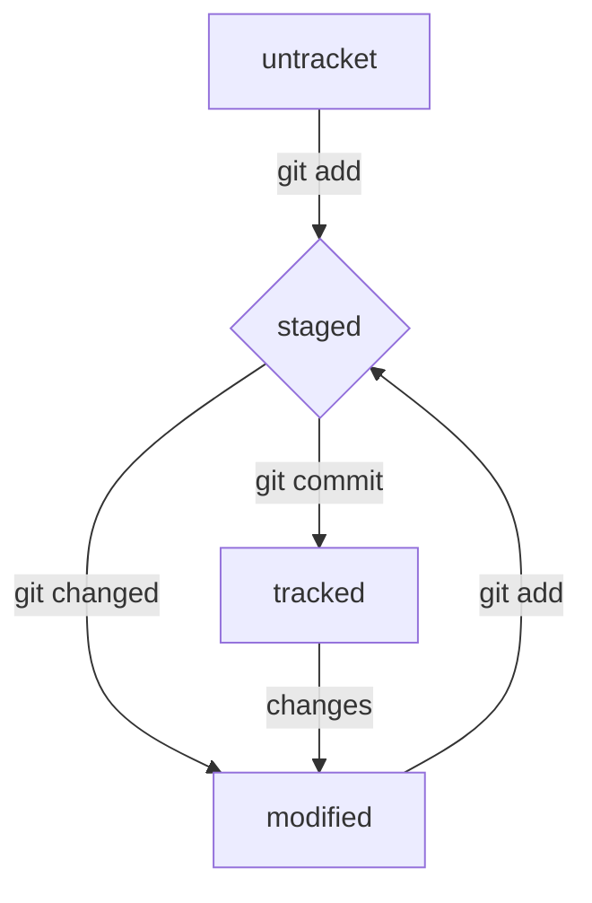

##### Привет!
#### Это шпаргалка по использованию GIT

##**Регистрация**

**Добавление имени и почты**  
$ git config --global user.name "ваше имя или ник латиницей"  
$ git config --global user.email ваша электронная почта 
 

**Проверка связи с удаленным репозиторием** 

$ git remote -v
origin    git@github.com:%ИМЯ_АККАУНТА%/%ИМЯ-ПРОЕКТА%.git (fetch)  
origin    git@github.com:%ИМЯ_АККАУНТА%/%ИМЯ-ПРОЕКТА%.git (push) 

**Связать с удаленным репозиторием локальный гит** 

$ git remote add origin git@github.com:%ИМЯ_АККАУНТА%/first-project.git

**Генерация SSH ключа**

$ ssh-keygen -t ed25519 -C "электронная почта, к которой привязан ваш аккаунт на GitHub" 

или 

$ ssh-keygen -t rsa -b 4096 -C "электронная почта, к которой привязан ваш аккаунт на GitHub" 

**Проверка** 

#Домашнаяя директория   
ls -a ~/.ssh  

ls -la .ssh/

# скопировать содержимое ключа в буфер обмена:  
$ clip < ~/.ssh/id_rsa.pub  
# для ed25519:  
$ clip < ~/.ssh/id_ed25519.pub   

**Навигация** 
1) *pwd* (от англ. print working directory, «показать рабочую папку») — покажи, в какой я папке; 

2) *ls* (от англ. list directory contents, «отобразить содержимое директории») — покажи файлы и папки в текущей папке; 

3) *ls -a* — покажи также скрытые файлы и папки, названия которых начинаются с символа .; 

4) *cd first-project* (от англ. change directory, «сменить директорию») — перейди в папку first-project; 

5) *cd first-project/html* — перейди в папку html, которая находится в папке first-project; 

6) *cd ..* — перейди на уровень выше, в родительскую папку; 

7) cd ~  — перейди в домашнюю директорию (/Users/Username); 

8) *cd /* — перейди в корневую директорию

**Работа с файлами и папками**

*Создание* 

1) *touch index.html* (англ. touch, «коснуться») — создай файл index.html в текущей папке; 

2) *touch index.html style.css script.js* — если нужно создать сразу несколько файлов, можно напечатать их имена в одну строку через пробел; 

3) *mkdir second-project* (от англ. make directory, «создать директорию») — создай папку с именем second-project в текущей папке. 
Копирование и перемещение 

4) *cp file.txt ~/my-dir* (от англ. copy, «копировать») — скопируй файл в другое место; ? mv file.txt ~/my-dir (от англ. move, «переместить») — перемести файл или папку в другое место. 

**Чтение**

 
1) *cat file.txt* (от англ. concatenate and print, «объединить и распечатать») — распечатай содержимое текстового файла file.txt. 
Удаление 

2) *rm about.html* (от англ. remove, «удалить») — удали файл about.html; 

3) *rmdir images* (от англ. remove directory, «удалить директорию») — удали папку images; 

4) *rm -r second-project* (от англ. remove, «удалить» + recursive, «рекурсивный») — удали папку second-project и всё, что она содержит.

**Полезные возможности**

 
1) Команды необязательно печатать и выполнять по очереди. Можно указать их списком — разделить двумя амперсандами **(&&)**. 

2) У консоли есть собственная память — буфер с несколькими последними командами. По ним можно перемещаться с помощью клавиш со стрелками вверх **(^)** и вниз **(v)**. 

3) Чтобы не вводить название файла или папки полностью, можно набрать первые символы имени и дважды нажать **Tab**. Если файл или папка есть в текущей директории, командная строка допишет путь сама. 
Например, вы находитесь в папке dev. Начните вводить cd first и дважды нажмите Tab. Если папка first-project есть внутри dev, командная строка автоматически подставит её имя. Останется только нажать Enter.

**Работа с удаленным репозиторием**

*Последовательность действий:*

git init  
git add .  
git commit -m 'Your Commit Text'  
git push -u origin master  

**Связь с удаленным репозиторием**

git clone 'your_repository_name' 

### **Схема коммитов**

